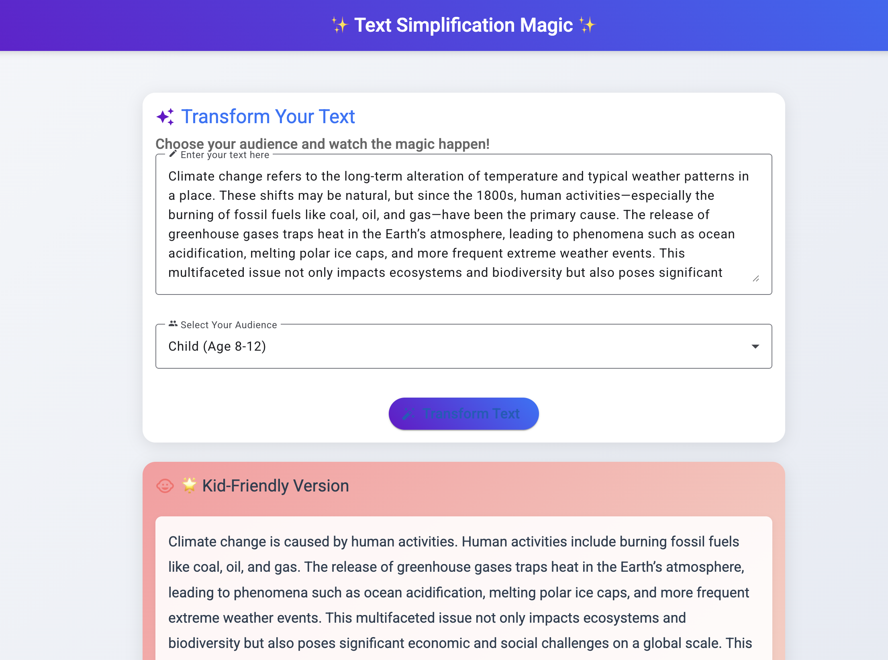

# AI Tools Comparison

A comparison of different AI development tools and their capabilities.

- This is Windsurf, an agentic IDE forked from VS Code.
- Flows = Agents + Copilots
- The Windsurf Editor is powered by an AI that can both collaborate with you like a Copilot and tackle complex tasks independently like an Agent. The AI is completely in sync with you, every step of the way.

## Projects

### 1. Windsurf

Located in `/Windsurf/`

#### Text Simplification App

A sophisticated text simplification tool that adapts complex text for different reading levels.

**Features:**

- Multi-level text adaptation (Child, Teen, Adult, Expert)
- Modern, responsive UI with intuitive design
- AI-powered text processing using Hugging Face
- Full-stack implementation with .NET Core and Angular

**Tech Stack:**

- Backend: ASP.NET Core
- Frontend: Angular with Material UI
- AI: Hugging Face API with FLAN-T5 model

[More details in the Text Simplification README](./Windsurf/TextSimplification/README.md)

## Screenshots





## Demo

[Demo Video](./assets/demo.gif)

## Repository Structure

```bash
AIComparison/
├── Windsurf/
│   ├── TextSimplification/      # .NET Core backend
│   └── text-simplification-client/  # Angular frontend
├── assets/                      # Media files and screenshots
└── README.md                    # Project documentation
```

## Setup Instructions

1. Create a GitHub repository named "AIComparison"
2. Clone this repository:

```bash
git clone <your-github-repo-url>
cd AIComparison
```

3. Follow the setup instructions in each project's README:

   - [Text Simplification Setup](./Windsurf/TextSimplification/README.md)

### Working with Configuration Files

- Each project has a `appsettings.template.json` showing the required configuration
- Copy the template to `appsettings.json` and add your API keys
- The `.gitignore` file ensures your API keys stay private
- You only need to set up the configuration once; Git will ignore your local settings

## Contributing

This repository is for comparing different AI development tools and approaches. Each project should:

- Have clear documentation
- Include setup instructions
- Maintain security best practices
- Demonstrate unique AI capabilities

## Security Notes

- All API keys and sensitive information should be kept in local configuration files
- Template files are provided for reference
- Follow the security guidelines in each project's README
